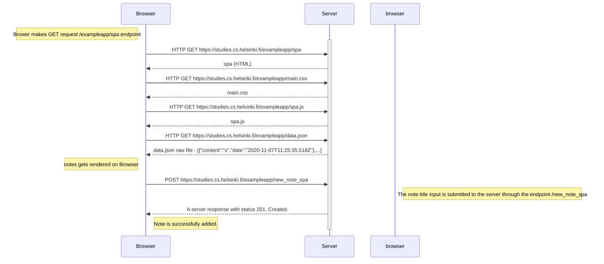

```mermaid
sequenceDiagram
participant Browser
participant Server

Note left of Browser: Brower makes GET request /exampleapp/spa endpoint
activate Server
Browser->>Server: HTTP GET https://studies.cs.helsinki.fi/exampleapp/spa
Server-->>Browser: spa (HTML)

Browser->>Server: HTTP GET https://studies.cs.helsinki.fi/exampleapp/main.css
Server-->>Browser: main.css

Browser->>Server: HTTP GET https://studies.cs.helsinki.fi/exampleapp/spa.js
Server-->>Browser: spa.js

Browser->>Server: HTTP GET https://studies.cs.helsinki.fi/exampleapp/data.json
Server-->>Browser: data.json raw file - [{"content":"x","date":"2020-11-07T11:25:35.518Z"},...]

Note left of Browser: notes gets rendered on Browser

Browser->>Server: POST https://studies.cs.helsinki.fi/exampleapp/new_note_spa
Note right of browser: The note title input is submitted to the server through the endpoint /new_note_spa
Server-->>Browser: A server response with status 201. Created.

Note right of Browser: Note is successfully added.
deactivate Server
```
